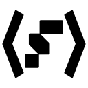

# Foundry Pro Chrome Extension

  

#### Releases

#### Release environments

## Purpose of the Extension
The Foundry Pro Chrome Extension is a tool designed to enhance the user experience of developers working on the Palantir Foundry platform, which is a data integration, management, and analysis platform.

The Chrome Extension provides additional functionality and features that are not available in the standard platform, such as custom search and shortcut keys, allowing developers to more easily and efficiently work with the data and tools available on the Palantir Foundry platform.

Furthermore, the Palantir Foundry Chrome Extension is an open-source tool that can be modified and improved by the development community. The extension's source code is available on GitHub, where developers can contribute by adding new features, fixing bugs, or improving the overall user experience.

The Palantir Foundry Chrome Extension is not an official tool provided by Palantir Technologies, but was created and is maintained by a group of developers who use Palantir Foundry. The tool is free to use and is not associated with any commercial entity.

Overall, the Palantir Pro Chrome Extension is a community-driven solution that provides additional features to enhance the development experience on Palantir Foundry.

## Current Features
Main features of the current release are:
- Quick access to `Session Token` (one click to clipboard)
- Quick creation and access to `Short-Live Developer Tokens` (one click to create and copy to clipboard)
- Customize additional menu entries (whithin the Popup-Settings)
- Customize `host` settings (on which hosts is the extension allowed to operate, auto detected and manually edited)
- Saving all settings in the `chrome.storage.sync` to share and save Settings over multiple browsers and machines within one Google Account.

## How this project works
You are welcome to contribute to the project. If you encounter any issues or have feature requests, please use the [Issue](https://github.com/KochC/Foundry-Pro-Chrome-Extension/issues) section in the repository to report them. To help organize the issues, we kindly ask that you use tags to indicate the type of issue or feature you are reporting. When submitting an issue or request, please provide as much information as possible, and if you have potential solutions to improve the code, please feel free to include them as well.

We use Git branching for our development workflow, and we welcome contributions from anyone who is interested in helping out. To contribute to the project, simply create a new branch following the naming convention "name/feature" or "name/issue-fix," and open a pull request to merge your changes into the "dev" branch. This allows us to review your changes, provide feedback, and discuss any necessary modifications before merging your code into the main branch. We appreciate your efforts to help improve the project!

## Data privacy disclaimer
It is important to note that the extension does not send any user data or usage information to any third-party servers or collect any data in any way.

The extension uses the `chrome.storage.sync` API, which is provided by the Chrome browser, to save user configuration data in a secure and private manner. The `chrome.storage.sync` API stores data in the user's Google Account, where it is encrypted and can only be accessed by the user who installed the extension. This ensures that the user's configuration data is safe and private and is not accessible by any third parties.

Overall, the Palantir Foundry Chrome Extension respects the privacy of its users and ensures that any user data is securely stored and not sent or collected in any way.

## What is a Chrome Extension
A Chrome extension is a software program that can be installed into the Chrome web browser to add functionality to it. Chrome extensions are created using web technologies such as HTML, CSS, and JavaScript, and they can interact with the content on web pages or with other Chrome browser features.

Chrome extensions can be used for a wide range of purposes, such as customizing the appearance of web pages, blocking ads, improving productivity, and providing additional features to online tools and platforms. They are distributed through the Chrome Web Store, where users can browse and install them with a single click.

Once installed, a Chrome extension runs in the background, and its functionality can be accessed through its icon in the browser toolbar or by interacting with the content on a web page. Users can easily enable or disable extensions, and they can configure their settings and permissions as needed.

Overall, Chrome extensions are a powerful way to extend the functionality of the Chrome web browser, and they are widely used by both developers and regular users alike to enhance their browsing experience.

## Development
### General overview
The Foundry Pro Chrome Extension is an open-source project that can be modified and improved by the development community. If you're interested in contributing to the extension or creating your own Chrome extension, here are some details about the Palantir Foundry Chrome Extension's development:

The Foundry Pro Chrome Extension is built using Manifest V3, which is the latest version of the Chrome extension manifest file. This version provides improved security, performance, and user privacy features, making it the recommended version for developing new Chrome extensions.

The extension is built using React, which is a popular JavaScript library for building user interfaces. The extension uses Node 14 as its development environment and uses the Webpack module bundler to compile and package the extension's source code.

For the UI components, the extension uses Blueprint, which is a UI toolkit developed by Palantir Technologies. Blueprint provides a set of reusable components and styles that can be used to quickly and easily build high-quality user interfaces that are consistent with the Palantir Foundry platform.

### How to compile
When developing a React-based Chrome extension, it is necessary to compile the React code into a format that can be used by the extension. This is where Webpack comes in.

Webpack is a module bundler for JavaScript that is commonly used in web development projects to bundle and package source code. Webpack works by taking multiple JavaScript modules and bundling them together into a single JavaScript file, which can then be loaded by a web browser.

To compile a React-based Chrome extension using Webpack, developers start by creating a React application using their preferred development tools. The application is then divided into separate modules, which can be imported and exported as needed.

The Webpack configuration file is then set up to define the entry point of the application, the output file, and the necessary loaders and plugins. Loaders are used to preprocess files before they are included in the bundle, while plugins are used to perform additional tasks such as minifying the code or generating source maps.

Once the Webpack configuration is set up, developers can run the Webpack build process, which compiles the React code into a single JavaScript file that can be loaded by the Chrome extension. The resulting bundle includes all of the required React components, as well as any necessary CSS styles, images, or other assets.

### CI/CD pipeline
The repository uses an automated CI/CD process that runs on GitHub Actions. This process automatically checks for issues and deploys new versions of the extension to the Chrome Web Store.

The CI/CD process is configured to run on the dev branch. Whenever changes are pushed to this branch, the automated checks are triggered. These checks include linting, testing, and building the extension. If any issues are found, the process will fail and the developer will be notified.

If the checks pass, the new version of the extension can be merged to the `main` branch.

Once the code is merged to the `main`branch, the pipeline will check the code again and the automated deployment process kicks in.
The deployment process includes packaging the extension, uploading it to the Chrome Web Store, and publishing the new version. This process is fully automated and requires no manual intervention from the developer.

In summary, the automated CI/CD process for the Chrome extension ensures that new changes are thoroughly tested and deployed to the Chrome Web Store quickly and efficiently. This helps to ensure a high level of quality and reliability for users of the extension.

Once a newer version reaches the Chrome Web Store, a review process will be started manually by the extension owner (same as the repository owner) followed by a review process by Google. One this process was successfull, the extension will automatically be published to the Chrome Web Store.

As part of the automated CI/CD process, the pipeline creates packages that can be manually downloaded (Releases and Pre-Releases) and added to Chrome. These packages include the compiled code for the extension, as well as any other necessary assets and resources.

These packages are created during the build process and can be found in the [release](https://github.com/KochC/Foundry-Pro-Chrome-Extension/releases) secion of the repository. Once the build process is complete, you can manually download the package and add it to Chrome as an unpacked extension.

While this process is less automated than deploying to the Chrome Web Store, it can be useful for testing and debugging the extension before it is officially released. By manually adding the extension to Chrome, you can test it in a real-world environment and make sure that it works as expected.
